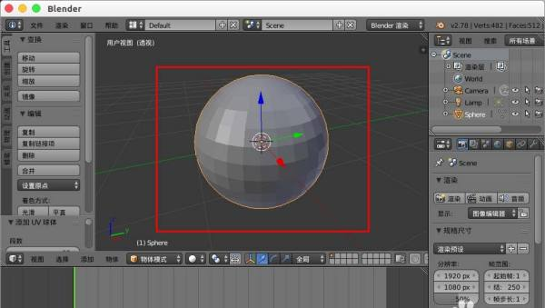
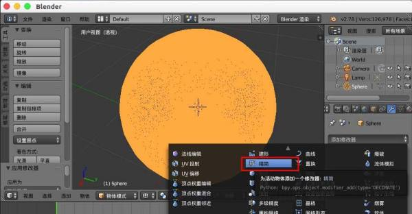
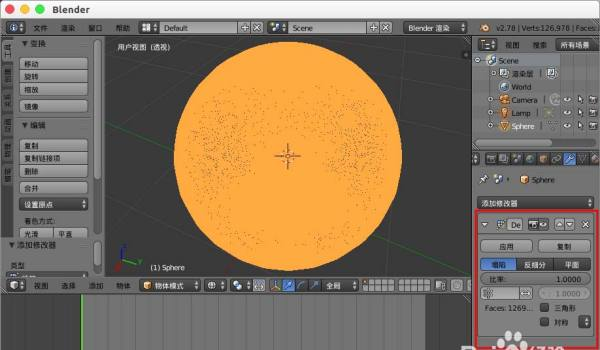
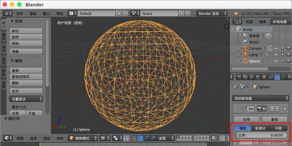
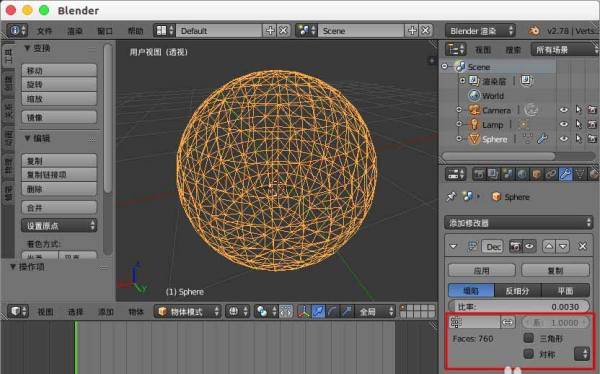
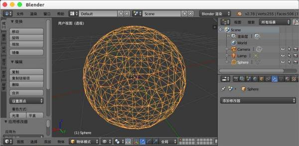
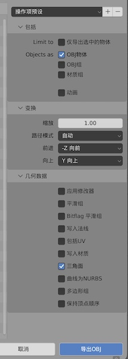

# use blender to LOD

* from <https://m.html.cn/tools/photoshop/96365.html>

* 1、打开blender创建一个球体。

    

* 2、编辑球体的时候我们对其进行了细分，这样网格面太多不好操作。

    

* 4、添加修改器选择“精简”。

    

* 4、修改器中包含，塌陷、反细分、平面等精简方式。

    

* 5、我们选择默认的“塌陷”，比率设置“0.003”我们发现模型网格面精简了好多。

    

* 6、“顶点组”是对模型中你选择的指定顶点组进行精简，勾选“三角形”，可以保留三角形网格不被精简，其它的反细分、平面可以自己尝试。

    

* 7、最后别忘记“应用”，就完成后模型网格的精简修改。

    

* 8、导出obj时选择选择“三角面”。

    
